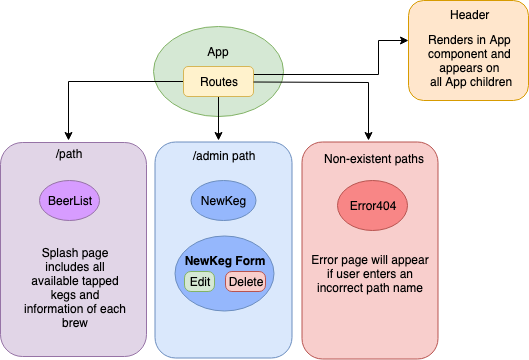

# Tap Room - React Build

#### _React Week 1 and 2, Independent Project, 7.4.19_

#### By _**Ashley Jessica Ancheta**_

## Description

This application is a build out of an in-class project that was previously written in Angular and is now using the React library.

## Technologies Used

  * _React 16.8.6_
  * _Webpack 3.12.0_
  * _React-Hot-Loader 3.1.3_
  * _Babel 6.26.3_
  * _eslint 4.19.1_
  * _Material UI 4.0.0-rc.0_
  * _JSX_

## Component and Route Tree

## Completed and in progress features

- [x] Navigation buttons creating custom icons using Figma
- [x] Client side routing
- [x] Component for list of beer on tap
- [x] Component for admin to edit beer information
- [x] CSS / Material UI styling
- [ ] Taking in admin information from a form and saving to local database

## Setup / Installation Requirements
### To open and view this project file
  * Clone this GitHub repository "https://github.com/ajancheta/tap-room-react.git" to your desktop. 
  * Open the repository in a preferred text editor such as Atom or Visual Studio Code.

  ### To run the application run the following commands
  * `npm install` This will allow the viewer of this project to have access to the CLI (command line interface) for webpack.
  * `npm run start` in the project directory in Terminal. 
  * Go to http://localhost:8080/ in the browser, preferably Google Chrome.
  * Note: The app will automatically reload if you change any of the source files. This is a continuous monitoring so to stop it just type the key combination `Ctrl + C` within the terminal.

## Known Bugs
There are no known bugs.

## Support and contact details
This application is best viewed on a full screen. Should any problems occur, discover other bugs, or experience issues with viewing, please contact me at ashleyjancheta@gmail.com

Copyright (c) 2019 **_Ashley J. Ancheta_**